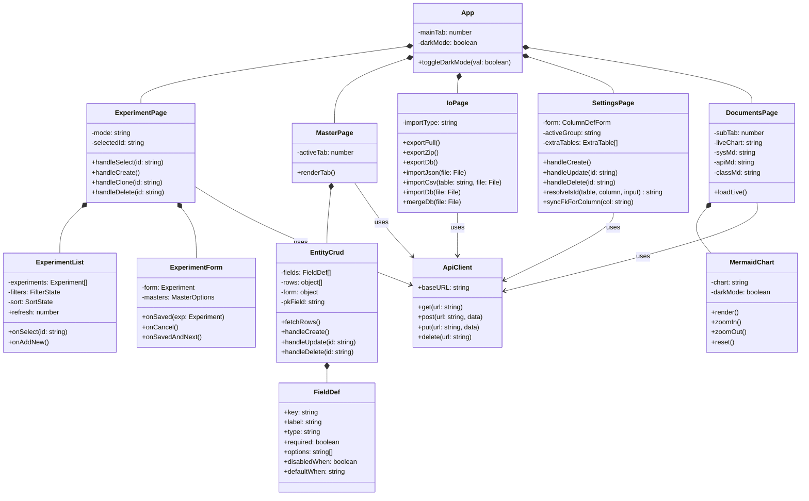
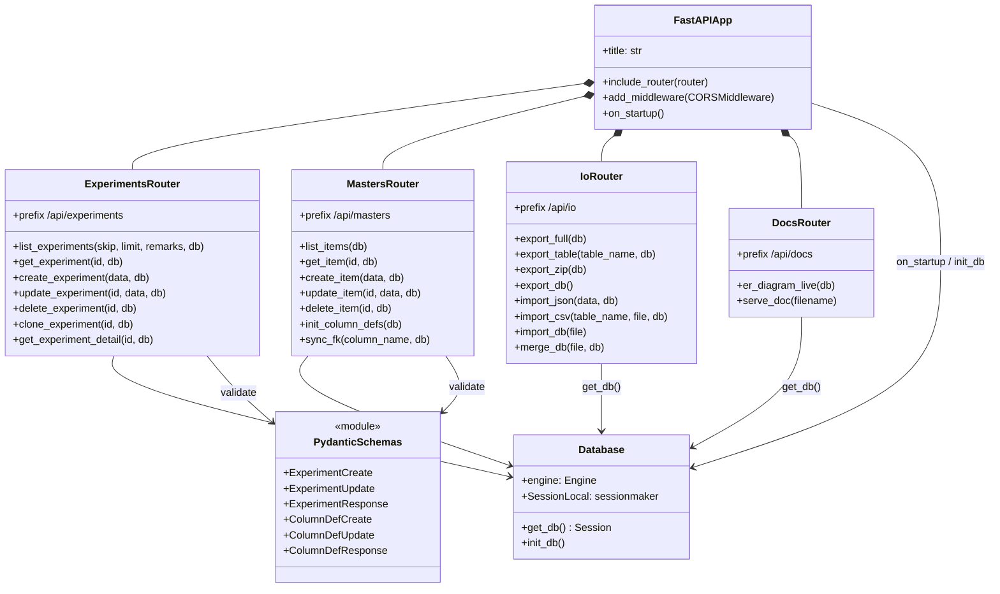

# Class Diagram — Software Structure

## Frontend

```mermaid
classDiagram
    class App {
        -mainTab: number
        -darkMode: boolean
        +toggleDarkMode(val: boolean)
    }

    class ExperimentPage {
        -mode: string
        -selectedId: string
        +handleSelect(id: string)
        +handleCreate()
        +handleClone(id: string)
        +handleDelete(id: string)
    }

    class MasterPage {
        -activeTab: number
        +renderTab()
    }

    class IoPage {
        -importType: string
        +exportFull()
        +exportZip()
        +exportDb()
        +importJson(file: File)
        +importCsv(table: string, file: File)
        +importDb(file: File)
        +mergeDb(file: File)
    }

    class SettingsPage {
        -form: ColumnDefForm
        -activeGroup: string
        -extraTables: ExtraTable[]
        +handleCreate()
        +handleUpdate(id: string)
        +handleDelete(id: string)
        +resolveIsId(table, column, input) string
        +syncFkForColumn(col: string)
    }

    class DocumentsPage {
        -subTab: number
        -liveChart: string
        -sysMd: string
        -apiMd: string
        -classMd: string
        +loadLive()
    }

    class ExperimentList {
        -experiments: Experiment[]
        -filters: FilterState
        -sort: SortState
        +onSelect(id: string)
        +onAddNew()
        +refresh: number
    }

    class ExperimentForm {
        -form: Experiment
        -masters: MasterOptions
        +onSaved(exp: Experiment)
        +onCancel()
        +onSavedAndNext()
    }

    class EntityCrud {
        -fields: FieldDef[]
        -rows: object[]
        -form: object
        -pkField: string
        +fetchRows()
        +handleCreate()
        +handleUpdate(id: string)
        +handleDelete(id: string)
    }

    class FieldDef {
        +key: string
        +label: string
        +type: string
        +required: boolean
        +options: string[]
        +disabledWhen: boolean
        +defaultWhen: string
    }

    class MermaidChart {
        -chart: string
        -darkMode: boolean
        +render()
        +zoomIn()
        +zoomOut()
        +reset()
    }

    class ApiClient {
        +baseURL: string
        +get(url: string)
        +post(url: string, data)
        +put(url: string, data)
        +delete(url: string)
    }

    App *-- ExperimentPage
    App *-- MasterPage
    App *-- IoPage
    App *-- SettingsPage
    App *-- DocumentsPage

    ExperimentPage *-- ExperimentList
    ExperimentPage *-- ExperimentForm
    MasterPage *-- EntityCrud
    EntityCrud *-- FieldDef
    DocumentsPage *-- MermaidChart

    ExperimentPage --> ApiClient : uses
    MasterPage --> ApiClient : uses
    IoPage --> ApiClient : uses
    SettingsPage --> ApiClient : uses
    DocumentsPage --> ApiClient : uses
```

---

## Backend 窶・Application Layer

```mermaid
classDiagram
    class FastAPIApp {
        +title: str
        +include_router(router)
        +add_middleware(CORSMiddleware)
        +on_startup()
    }

    class ExperimentsRouter {
        +prefix /api/experiments
        +list_experiments(skip, limit, remarks, db)
        +get_experiment(id, db)
        +create_experiment(data, db)
        +update_experiment(id, data, db)
        +delete_experiment(id, db)
        +clone_experiment(id, db)
        +get_experiment_detail(id, db)
    }

    class MastersRouter {
        +prefix /api/masters
        +list_items(db)
        +get_item(id, db)
        +create_item(data, db)
        +update_item(id, data, db)
        +delete_item(id, db)
        +init_column_defs(db)
        +sync_fk(column_name, db)
    }

    class IoRouter {
        +prefix /api/io
        +export_full(db)
        +export_table(table_name, db)
        +export_zip(db)
        +export_db()
        +import_json(data, db)
        +import_csv(table_name, file, db)
        +import_db(file)
        +merge_db(file, db)
    }

    class DocsRouter {
        +prefix /api/docs
        +er_diagram_live(db)
        +serve_doc(filename)
    }

    class Database {
        +engine: Engine
        +SessionLocal: sessionmaker
        +get_db() Session
        +init_db()
    }

    class PydanticSchemas {
        <<module>>
        +ExperimentCreate
        +ExperimentUpdate
        +ExperimentResponse
        +ColumnDefCreate
        +ColumnDefUpdate
        +ColumnDefResponse
    }

    FastAPIApp *-- ExperimentsRouter
    FastAPIApp *-- MastersRouter
    FastAPIApp *-- IoRouter
    FastAPIApp *-- DocsRouter
    FastAPIApp --> Database : on_startup / init_db

    ExperimentsRouter --> Database : get_db()
    MastersRouter --> Database : get_db()
    IoRouter --> Database : get_db()
    DocsRouter --> Database : get_db()

    ExperimentsRouter --> PydanticSchemas : validate
    MastersRouter --> PydanticSchemas : validate
```
