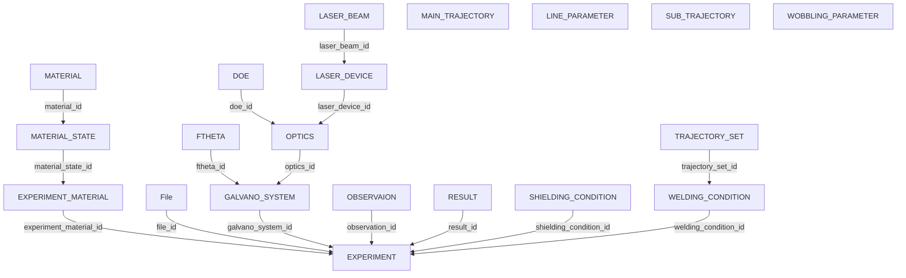

# 実験db.xlsx データベース仕様書（完全版・説明列追加）

本資料は **実験db.xlsx** に含まれる全シートを機械的に読み取り、各テーブルの **全カラム（2行目=型 / 3行目=備考）** に加えて **説明（自動生成）** を付与した仕様書です。

## 共通ルール
- 1行目：項目名（カラム名）
- 2行目：型（string / float / boolean 等）
- 3行目：備考（選択肢・制約・例）
- 4行目以降：実データ

## ER 図（上→下）
Mermaid の **flowchart TD** で上から下に並ぶように出力しています（*_id の参照から自動推定）。

---

## テーブル定義（全テーブル）

### EXPERIMENT

- 主キー（推定）: `experiment_id`
- 外部キー候補: `galvano_system_id`, `welding_condition_id`, `experiment_material_id`, `shielding_condition_id`, `result_id`, `observation_id`, `file_id`

| 項目名 | 型（2行目） | 備考（3行目） | 説明（追加） |
|---|---|---|---|
| experiment_id | string | UUID v4 | EXPERIMENT を参照するID（外部キー） |
| galvano_system_id | string | UUID v4 | GALVANO_SYSTEM を参照するID（外部キー） |
| welding_condition_id | string | UUID v4 | WELDING_CONDITION を参照するID（外部キー） |
| experiment_material_id | string | UUID v4 | EXPERIMENT_MATERIAL を参照するID（外部キー） |
| shielding_condition_id | string | UUID v4 | SHIELDING_CONDITION を参照するID（外部キー） |
| result_id | string | UUID v4 | RESULT を参照するID（外部キー） |
| observation_id | string | UUID v4 | OBSERVAION を参照するID（外部キー） |
| file_id | string | UUID v4 | File を参照するID（外部キー） |
| remarks | string | ― | 備考（自由記述） |

### GALVANO_SYSTEM

- 主キー（推定）: `galvano_system_id`
- 外部キー候補: `ftheta_id`, `optics_id`

| 項目名 | 型（2行目） | 備考（3行目） | 説明（追加） |
|---|---|---|---|
| galvano_system_id | string | UUID v4 | GALVANO_SYSTEM を参照するID（外部キー） |
| galvano_type | string | basic / hybrid / OCT / hybrid+OCT | 種別・タイプ（分類） |
| serial_number | string | ― | シリアル番号 |
| ftheta_id | string | UUID v4 | FTHETA を参照するID（外部キー） |
| optics_id | string | UUID v4 | OPTICS を参照するID（外部キー） |
| main_diameter_um | float | ― | 寸法・直径（μm） |
| sub_diameter_um | float | ― | 寸法・直径（μm） |
| OCT_diameter_um | float | ― | 寸法・直径（μm） |
| remarks | string | ― | 備考（自由記述） |

### FTHETA

- 主キー（推定）: `ftheta_id`
- 外部キー候補: （なし）

| 項目名 | 型（2行目） | 備考（3行目） | 説明（追加） |
|---|---|---|---|
| ftheta_id | string | UUID v4 | FTHETA を参照するID（外部キー） |
| manufacturer | string | ― | メーカー名 |
| model_name | string | ― | 型式・モデル名 |
| serial_number | string | ― | シリアル番号 |
| ftheta_focal_mm | float | ― | 寸法・長さ（mm） |
| remarks | string | ― | 備考（自由記述） |

### OPTICS

- 主キー（推定）: `optics_id`
- 外部キー候補: `laser_device_id`, `doe_id`

| 項目名 | 型（2行目） | 備考（3行目） | 説明（追加） |
|---|---|---|---|
| optics_id | string | UUID v4 | OPTICS を参照するID（外部キー） |
| manufacturer | string | ― | メーカー名 |
| optics_role | string | main / sub / OCT | 役割（main/sub/OCT 等） |
| collimator_focal_mm | float | ― | 寸法・長さ（mm） |
| serial_number | string | ― | シリアル番号 |
| laser_device_id | string | ― | LASER_DEVICE を参照するID（外部キー） |
| doe_id | string | UUID v4 | DOE を参照するID（外部キー） |
| remarks | string | ― | 備考（自由記述） |

### LASER_DEVICE

- 主キー（推定）: `laser_device_id`
- 外部キー候補: `laser_beam_id`

| 項目名 | 型（2行目） | 備考（3行目） | 説明（追加） |
|---|---|---|---|
| laser_device_id | string | UUID v4 | LASER_DEVICE を参照するID（外部キー） |
| manufacturer | string | IPG / COHERENT | メーカー名 |
| model_name | string | ― | 型式・モデル名 |
| serial_number | string | ― | シリアル番号 |
| beam_structure | string | single / core_ring / hybrid | ビーム構成（single/core_ring/hybrid 等） |
| laser_beam_id | string | UUID v4 | LASER_BEAM を参照するID（外部キー） |
| remarks | string | ― | 備考（自由記述） |

### LASER_BEAM

- 主キー（推定）: `laser_beam_id`
- 外部キー候補: （なし）

| 項目名 | 型（2行目） | 備考（3行目） | 説明（追加） |
|---|---|---|---|
| laser_beam_id | string | UUID v4 | LASER_BEAM を参照するID（外部キー） |
| beam_type | ― | single / multi / ring | 種別・タイプ（分類） |
| wavelength_nm | ― | 450 / 1064 | 項目 |
| numerical_aperture | ― | ― | 項目 |
| m2_value | ― | ― | 項目 |
| bpp_mm_mrad | ― | ― | 項目 |
| core_diameter_um | ― | ― | 寸法・直径（μm） |
| ring_inner_diameter_um | ― | ― | 寸法・直径（μm） |
| ring_outer_diameter_um | ― | ― | 寸法・直径（μm） |
| remarks | ― | ― | 備考（自由記述） |

### DOE

- 主キー（推定）: `doe_id`
- 外部キー候補: （なし）

| 項目名 | 型（2行目） | 備考（3行目） | 説明（追加） |
|---|---|---|---|
| doe_id | string | UUID v4 | DOE を参照するID（外部キー） |
| manufacturer | string | ― | メーカー名 |
| model_name | string | ― | 型式・モデル名 |
| serial_number | string | ― | シリアル番号 |
| profile_shape | string | top-hat / gaussian / donut / gaussian+dunut | ビーム強度分布形状（top-hat/gaussian/donut 等） |
| remarks | string | ― | 備考（自由記述） |

### WELDING_CONDITION

- 主キー（推定）: `welding_condition_id`
- 外部キー候補: `trajectory_set_id`

| 項目名 | 型（2行目） | 備考（3行目） | 説明（追加） |
|---|---|---|---|
| welding_condition_id | string | UUID v4 | WELDING_CONDITION を参照するID（外部キー） |
| main_power_w | string | ― | 出力（W） |
| sub_power_w | string | ― | 出力（W） |
| welding_speed_mm_s | string | ― | 文字列 |
| main_focus_offset_mm | string | ― | 寸法・長さ（mm） |
| sub_focus_offset_mm | ― | ― | 寸法・長さ（mm） |
| trajectory_set_id | ― | UUID v4 | TRAJECTORY_SET を参照するID（外部キー） |
| remarks | ― | ― | 備考（自由記述） |

### TRAJECTORY_SET

- 主キー（推定）: `trajectory_set_id`
- 外部キー候補: `main_trajectry_id`, `sub_trajectry_id`

| 項目名 | 型（2行目） | 備考（3行目） | 説明（追加） |
|---|---|---|---|
| trajectory_set_id | string | UUID v4 | TRAJECTORY_SET を参照するID（外部キー） |
| main_trajectry_id | string | UUID v4 | 参照ID（外部キー） |
| sub_trajectry_id | string | UUID v4 | 参照ID（外部キー） |
| trajectry_csv_path | string | ./*.csv | CSVファイルのパス |
| remarks | ― | ― | 備考（自由記述） |

### MAIN_TRAJECTORY

- 主キー（推定）: `main_trajectory_id`
- 外部キー候補: `main_trajectory_parameter_id`

| 項目名 | 型（2行目） | 備考（3行目） | 説明（追加） |
|---|---|---|---|
| main_trajectory_id | string | UUID v4 | MAIN_TRAJECTORY を参照するID（外部キー） |
| main_trajectory_parameter_id | string | UUID v4 | 参照ID（外部キー） |
| main_trajectory_type | string | line / circle / spiral | 種別・タイプ（分類） |
| remarks | ― | ― | 備考（自由記述） |

### LINE_PARAMETER

- 主キー（推定）: `main_trajectory_type_parameter_id`
- 外部キー候補: （なし）

| 項目名 | 型（2行目） | 備考（3行目） | 説明（追加） |
|---|---|---|---|
| main_trajectory_type_parameter_id | string | UUID v4 | LINE_PARAMETER を参照するID（外部キー） |
| length | float | ― | 数値 |
| remarks | ― | ― | 備考（自由記述） |

### SUB_TRAJECTORY

- 主キー（推定）: `sub_trajectory_id`
- 外部キー候補: `sub_trajectory_parameter_id`

| 項目名 | 型（2行目） | 備考（3行目） | 説明（追加） |
|---|---|---|---|
| sub_trajectory_id | string | UUID v4 | SUB_TRAJECTORY を参照するID（外部キー） |
| sub_trajectory_parameter_id | string | UUID v4 | 参照ID（外部キー） |
| sub_trajectory_type | string | wobbling / raster / eight | 種別・タイプ（分類） |
| remarks | ― | ― | 備考（自由記述） |

### WOBBLING_PARAMETER

- 主キー（推定）: `sub_trajectory_type_parameter_id`
- 外部キー候補: （なし）

| 項目名 | 型（2行目） | 備考（3行目） | 説明（追加） |
|---|---|---|---|
| sub_trajectory_type_parameter_id | string | UUID v4 | WOBBLING_PARAMETER を参照するID（外部キー） |
| wobble_radius_mm | float | ― | 寸法・長さ（mm） |
| wobble_frequency_hz | float | ― | 周波数（Hz） |
| circumferential_speed | float | ― | 数値 |
| remarks | ― | ― | 備考（自由記述） |

### EXPERIMENT_MATERIAL

- 主キー（推定）: `experiment_material_id`
- 外部キー候補: `material_state_id`

| 項目名 | 型（2行目） | 備考（3行目） | 説明（追加） |
|---|---|---|---|
| experiment_material_id | string | UUID v4 | EXPERIMENT_MATERIAL を参照するID（外部キー） |
| material_state_id | string | ― | MATERIAL_STATE を参照するID（外部キー） |
| material_role | string | ― | 役割（main/sub/OCT 等） |
| remarks | string | ― | 備考（自由記述） |

### MATERIAL_STATE

- 主キー（推定）: `material_state_id`
- 外部キー候補: `material_id`

| 項目名 | 型（2行目） | 備考（3行目） | 説明（追加） |
|---|---|---|---|
| material_state_id | string | UUID v4 | MATERIAL_STATE を参照するID（外部キー） |
| material_id | string | UUID v4 | MATERIAL を参照するID（外部キー） |
| thickness_mm | float | ― | 寸法・長さ（mm） |
| width_mm | float | ― | 寸法・長さ（mm） |
| length_mm | float | ― | 寸法・長さ（mm） |
| surface_condition | ― | ― | 項目 |
| remarks | string | ― | 備考（自由記述） |

### MATERIAL

- 主キー（推定）: `material_id`
- 外部キー候補: （なし）

| 項目名 | 型（2行目） | 備考（3行目） | 説明（追加） |
|---|---|---|---|
| material_id | string | UUID v4 | MATERIAL を参照するID（外部キー） |
| material_name | string | Al / Cu | 文字列 |
| material_class | string | ― | 文字列 |
| density_kg_m3 | float | ― | 数値 |
| thermal_conductivity_w_mk | float | ― | 数値 |
| reflectivity_1070nm | float | ― | 数値 |
| remarks | string | ― | 備考（自由記述） |

### SHIELDING_CONDITION

- 主キー（推定）: `shielding_condition_id`
- 外部キー候補: （なし）

| 項目名 | 型（2行目） | 備考（3行目） | 説明（追加） |
|---|---|---|---|
| shielding_condition_id | string | UUID v4 | SHIELDING_CONDITION を参照するID（外部キー） |
| gas_type | string | ― | 種別・タイプ（分類） |
| gas_purity_percent | string | ― | 割合（%） |
| gas_flow_l_min | float | ― | 流量（L/min） |
| gas_pressure_kpa | float | ― | 圧力（kPa） |
| nozzle_type | string | ― | 種別・タイプ（分類） |
| nozzle_diameter_mm | float | ― | 寸法・長さ（mm） |
| nozzle_distance_mm | float | ― | 寸法・長さ（mm） |
| nozzle_angle_deg | float | ― | 角度（deg） |
| remarks | string | ― | 備考（自由記述） |

### RESULT

- 主キー（推定）: `result_id`
- 外部キー候補: （なし）

| 項目名 | 型（2行目） | 備考（3行目） | 説明（追加） |
|---|---|---|---|
| result_id | string | UUID v4 | RESULT を参照するID（外部キー） |
| oct_depth_mm | string | ― | 寸法・長さ（mm） |
| oct_surface_csv_path | string | ― | CSVファイルのパス |
| oct_depth_csv_path | string | ― | CSVファイルのパス |
| oct_result_csv_path | string | ― | CSVファイルのパス |
| cross_section_depth_mm | float | ― | 寸法・長さ（mm） |
| spatter_flag | boolean | 0/1 | 有無フラグ（0/1, True/False） |
| spatter_severity | float | ― | 数値 |
| gap_opening_flag | boolean | 0/1 | 有無フラグ（0/1, True/False） |
| crack_flag | boolean | 0/1 | 有無フラグ（0/1, True/False） |
| crack_severity | float | ― | 数値 |
| glass_contamination | boolean | 0/1 | 汚れ・コンタミ有無 |
| surface_contamination | boolean | 0/1 | 汚れ・コンタミ有無 |
| penetration_flag | boolean | 0/1 | 有無フラグ（0/1, True/False） |
| remarks | string | ― | 備考（自由記述） |

### OBSERVAION

- 主キー（推定）: `observation_id`
- 外部キー候補: （なし）

| 項目名 | 型（2行目） | 備考（3行目） | 説明（追加） |
|---|---|---|---|
| observation_id | string | UUID v4 | OBSERVAION を参照するID（外部キー） |
| observer_name | string | ― | 観察者名 |
| observation_datetime | string | 20●●/●●/●● | 観察日時 |
| comment | string | ― | コメント（自由記述） |
| remarks | string | ― | 備考（自由記述） |

### File

- 主キー（推定）: `file_id`
- 外部キー候補: （なし）

| 項目名 | 型（2行目） | 備考（3行目） | 説明（追加） |
|---|---|---|---|
| file_id | string | UUID v4 | File を参照するID（外部キー） |
| remarks | string | ― | 備考（自由記述） |
