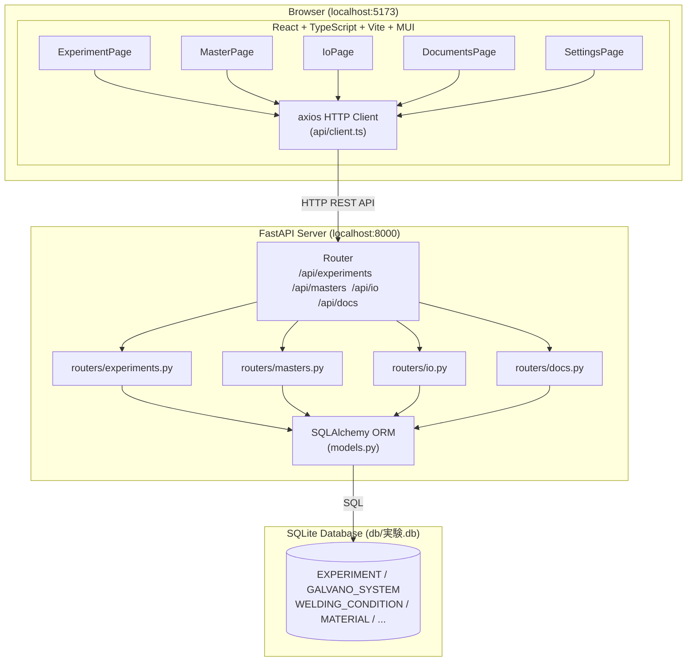

# システム構成図 — Laser Experiment Database

---

## 1. Software Architecture



---

## 2. フロントエンド構成

| コンポーネント | パス | 説明 |
|--------------|------|------|
| App | `src/App.tsx` | ルーティング、ナビゲーションバー、ダークモード切替 |
| ExperimentPage | `src/pages/ExperimentPage.tsx` | 実験一覧・詳細・CRUD |
| MasterPage | `src/pages/MasterPage.tsx` | 各種マスタデータ CRUD（タブ切替） |
| IoPage | `src/pages/IoPage.tsx` | データのインポート／エクスポート |
| DocumentsPage | `src/pages/DocumentsPage.tsx` | システム構成図・ER図・API Reference |
| SettingsPage | `src/pages/SettingsPage.tsx` | カラム定義管理・表示色設定 |
| EntityCrud | `src/components/masters/EntityCrud.tsx` | 汎用 CRUD テーブルコンポーネント |
| ExperimentList | `src/components/experiments/ExperimentList.tsx` | 実験一覧テーブル |
| ExperimentForm | `src/components/experiments/ExperimentForm.tsx` | 実験フォーム |
| MermaidChart | `src/components/MermaidChart.tsx` | Mermaid ER 図レンダラ |

---

## 3. バックエンド構成

| モジュール | パス | 説明 |
|-----------|------|------|
| main.py | `backend/main.py` | FastAPI アプリ初期化、ルータ登録、CORS 設定 |
| database.py | `backend/database.py` | SQLAlchemy エンジン・セッション設定 |
| models.py | `backend/models.py` | ORM モデル定義（全テーブル） |
| schemas.py | `backend/schemas.py` | Pydantic スキーマ（リクエスト／レスポンス型） |
| routers/experiments.py | `backend/routers/experiments.py` | 実験 CRUD + clone + detail |
| routers/masters.py | `backend/routers/masters.py` | 全マスタ CRUD + column-defs 管理 |
| routers/io.py | `backend/routers/io.py` | インポート／エクスポート処理 |
| routers/docs.py | `backend/routers/docs.py` | ER 図動的生成・ドキュメントファイル配信 |

---

## 4. データベース テーブル一覧

| グループ | テーブル名 | 主キー | 説明 |
|---------|-----------|:------:|------|
| EXPERIMENT | EXPERIMENT | UUID | 実験の基本レコード（全マスタへの参照） |
| GALVANO | GALVANO_SYSTEM | UUID | ガルバノスキャナシステム |
| GALVANO | FTHETA | UUID | Fθ レンズ |
| GALVANO | OPTICS | (string, string) | 光学系（役割: main/sub/OCT）|
| GALVANO | LASER_DEVICE | UUID | レーザー発振器 |
| GALVANO | LASER_BEAM | (string, string) | ビームプロファイル（種類: single/ring/multi） |
| GALVANO | DOE | UUID | DOE（回折光学素子） |
| WELDING | WELDING_CONDITION | UUID | 溶接パラメータ（出力・速度・フォーカス） |
| WELDING | TRAJECTORY_SET | UUID | トラジェクトリセット |
| WELDING | MAIN_TRAJECTORY | UUID | メイントラジェクトリ種別 |
| WELDING | LINE_PARAMETER | UUID | ラインスキャンパラメータ |
| WELDING | SUB_TRAJECTORY | UUID | サブトラジェクトリ種別 |
| WELDING | WOBBLING_PARAMETER | UUID | ウォブリングパラメータ |
| MATERIAL | EXPERIMENT_MATERIAL | UUID | 実験に使用する材料セット |
| MATERIAL | MATERIAL_STATE | UUID | 材料の形状・表面状態 |
| MATERIAL | MATERIAL | UUID | 材料の物性情報 |
| SHIELDING | SHIELDING_CONDITION | UUID | シールドガス条件 |
| RESULT | RESULT | UUID | 実験結果（OCT深さ・欠陥フラグ等） |
| OBSERVATION | OBSERVATION | UUID | 観察記録 |
| FILE | FILE | UUID | 関連ファイル参照 |
| SETTINGS | COLUMN_DEF | UUID | カラム表示定義 |

---

## 5. テクノロジースタック

| 区分 | 技術 | バージョン |
|------|------|-----------|
| Frontend フレームワーク | React | 18+ |
| 言語 | TypeScript | 5+ |
| ビルドツール | Vite | 5+ |
| UI コンポーネント | Material UI (MUI) | 5+ |
| HTTP クライアント | axios | — |
| Markdown レンダラ | react-markdown + remark-gfm | — |
| ER 図 | Mermaid | — |
| Backend フレームワーク | FastAPI | 0.100+ |
| ORM | SQLAlchemy | 2.x |
| バリデーション | Pydantic | v2 |
| データベース | SQLite | 3.x |
| 実行環境 | Python | 3.11+ |

---

## 6. データフロー概要

```
[実験実施]
    │
    ▼
[マスタ登録] ─── ガルバノ設定 / 溶接条件 / 材料 / シールド条件
    │
    ▼
[実験レコード作成] ─── 各マスタ ID を参照
    │
    ├─▶ [結果入力] ─── OCT 深さ, 欠陥フラグ
    ├─▶ [観察記録] ─── コメント, 日時
    └─▶ [ファイル登録] ─── 関連データパス

[エクスポート] ─── JSON / CSV ZIP / SQLite DB
[インポート]   ─── JSON / CSV / SQLite DB (上書き or マージ)
```
